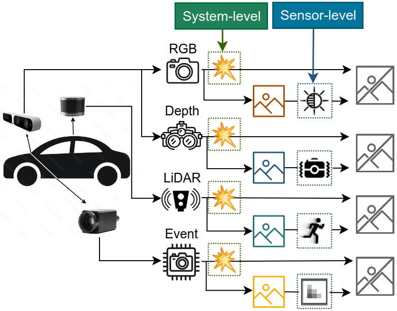
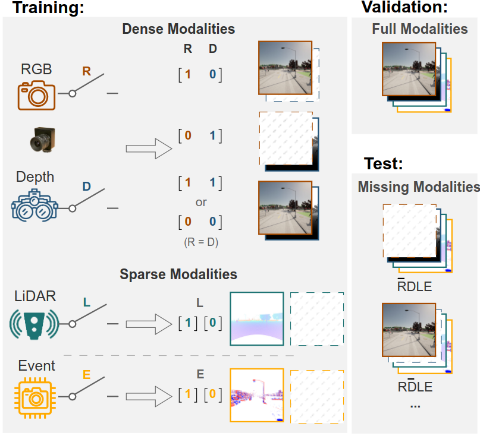
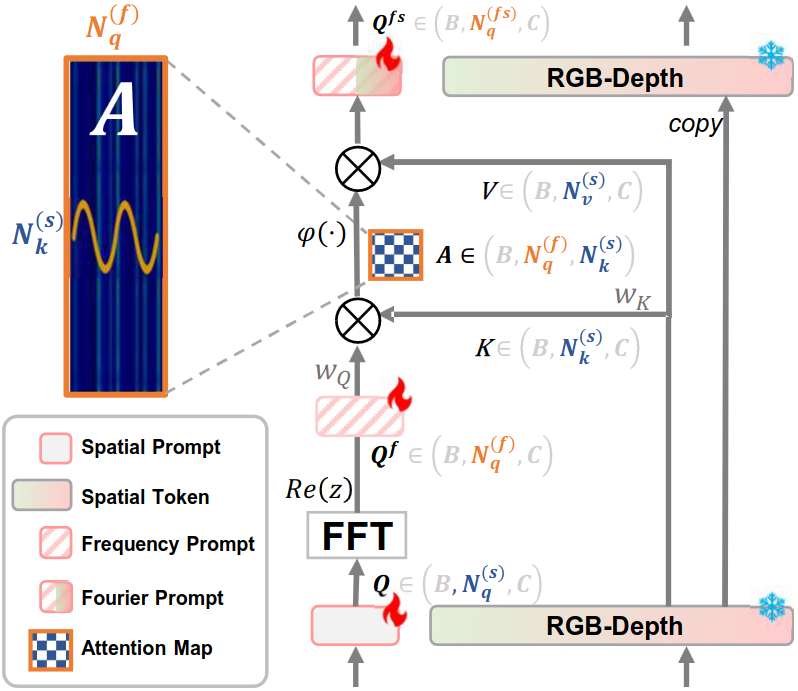

# MISS
In this work, we establish a task called Modality-Incomplete Scene Segmentation (MISS), which encompasses both system-level modality absence and sensor-level modality errors. 
<p align="center">
  
</p>
We introduce a Missing-aware Modal Switch (MMS) strategy to proactively manage missing modalities during training, utilizing bit-level batch-wise sampling to enhance the models's performance in both complete and incomplete testing scenarios. Furthermore, we introduce the Fourier Prompt Tuning (FPT) method to incorporate representative spectral information into a limited number of learnable prompts that maintain robustness against all MISS scenarios. 
<div style="display:inline-block" align="center">
  
  
</div>

## Citation
If you use our OpenSU, please cite
```
@article{liu2024fourier,
  title={Fourier Prompt Tuning for Modality-Incomplete Scene Segmentation},
  author={Liu, Ruiping and Zhang, Jiaming and Peng, Kunyu and Chen, Yufan and Cao, Ke and Zheng, Junwei and Sarfraz, M Saquib and Yang, Kailun and Stiefelhagen, Rainer},
  journal={arXiv preprint arXiv:2401.16923},
  year={2024}
}

```
